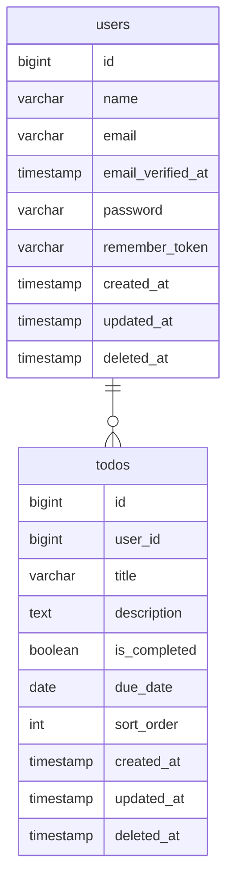

# Laravel Todo App

## Overview
Laravelで構築したToDoアプリケーションです。  
Dockerで開発環境を構築し、認証・CRUD・検索機能を実装します。

## Features
### 認証機能
- ユーザー登録
- ログイン
- ログアウト

### タスク管理機能
- タスク一覧
- タスク詳細
- タスク登録
- タスク編集
- タスク削除
- タスク完了
- 並び替え

### 検索機能
- キーワード検索
- ステータス検索
- 期限検索

### アカウント管理機能
- プロフィール編集
- アカウント削除

## Transition


## Stack
### Frontend


### Backend


### Infrastructure


### Others


## Directory
```bash
todo/
├── docker/
│   ├── apache/         # Apache設定
│   ├── php/            # PHP設定
│   └── mysql/          # MySQL設定
├── src/
│   ├── app/            # アプリケーションロジック
│   ├── database/       # マイグレーション・Seeder
│   ├── public/         # 公開ディレクトリ
│   ├── resources/      # Blade・SCSS・JavaScript
│   ├── routes/         # ルーティング
│   └── tests/          # テストコード
├── docker-compose.yml  # Docker Compose設定
├── .env.example        # 環境変数サンプル
├── .gitignore
└── README.md
```

## Database
### users
| Column | Type | Null | Key | Default | Description |
|---|---|---|---|---|---|
| id | BIGINT | NO | PK | AUTO_INCREMENT | ユーザーID |
| name | VARCHAR(255) | NO | - | - | ユーザー名 |
| email | VARCHAR(255) | NO | UQ | - | メールアドレス |
| email_verified_at | TIMESTAMP | YES | - | NULL | メール認証日時 |
| password | VARCHAR(255) | NO | - | - | パスワード |
| remember_token | VARCHAR(100) | YES | - | NULL | ログイン保持トークン |
| created_at | TIMESTAMP | YES | - | NULL | 登録日時 |
| updated_at | TIMESTAMP | YES | - | NULL | 更新日時 |
| deleted_at | TIMESTAMP | YES | - | NULL | 削除日時 |

### todos
| Column | Type | Null | Key | Default | Description |
|---|---|---|---|---|---|
| id | BIGINT | NO | PK | AUTO_INCREMENT | ToDo ID |
| user_id | BIGINT | NO | FK | - | ユーザーID |
| title | VARCHAR(255) | NO | - | - | タイトル |
| description | TEXT | YES | - | NULL | 説明 |
| is_completed | BOOLEAN | NO | - | false | 完了フラグ |
| due_date | DATE | YES | - | NULL | 期限日 |
| sort_order | INT | NO | - | 0 | 表示順 |
| created_at | TIMESTAMP | YES | - | NULL | 登録日時 |
| updated_at | TIMESTAMP | YES | - | NULL | 更新日時 |
| deleted_at | TIMESTAMP | YES | - | NULL | 削除日時 |

## ER


## License
MIT
